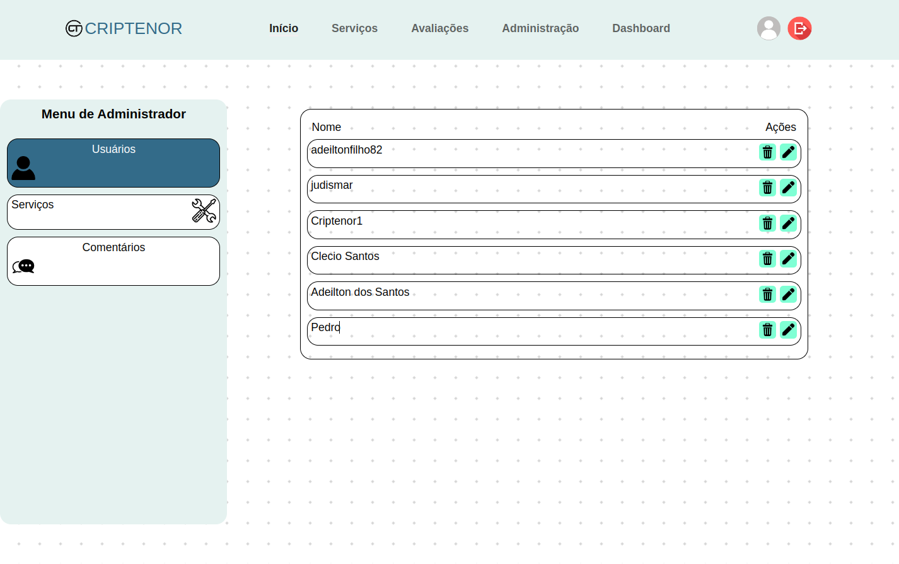
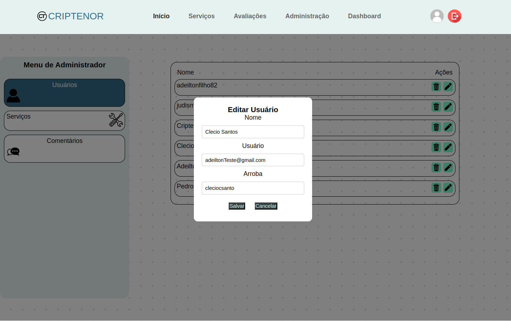
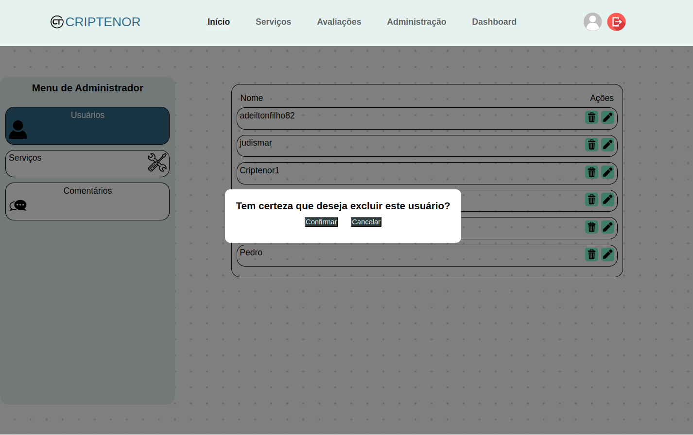
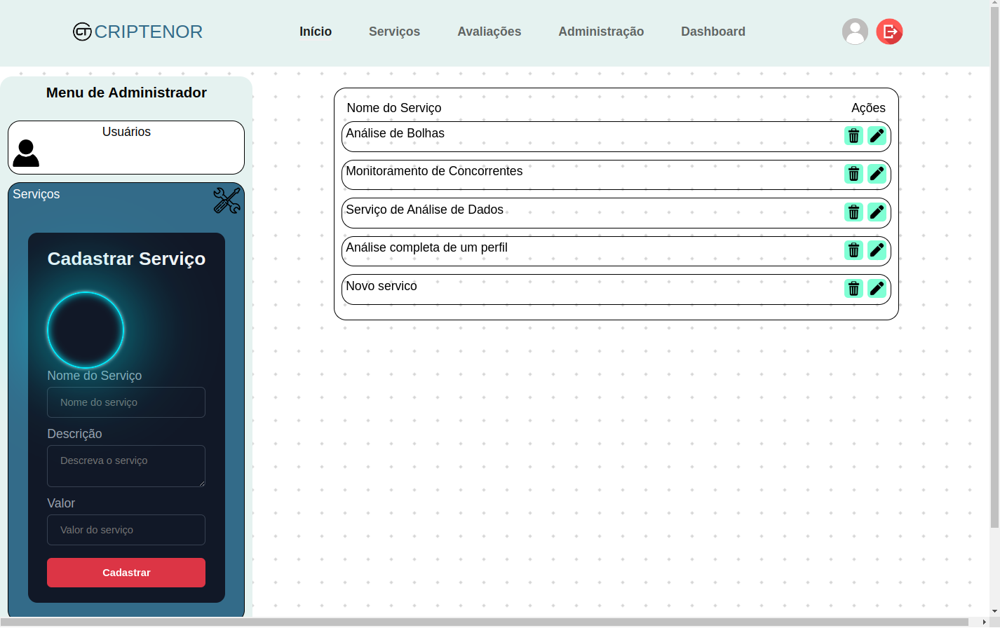
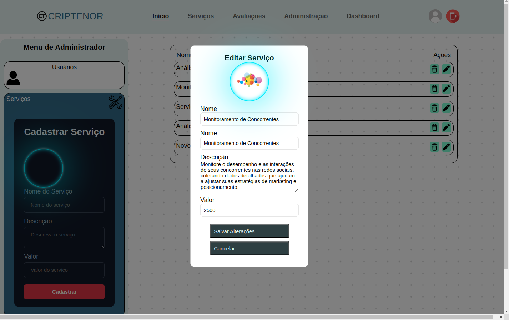
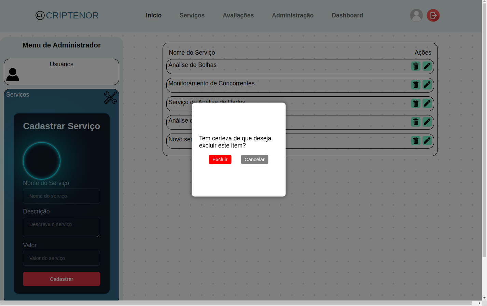
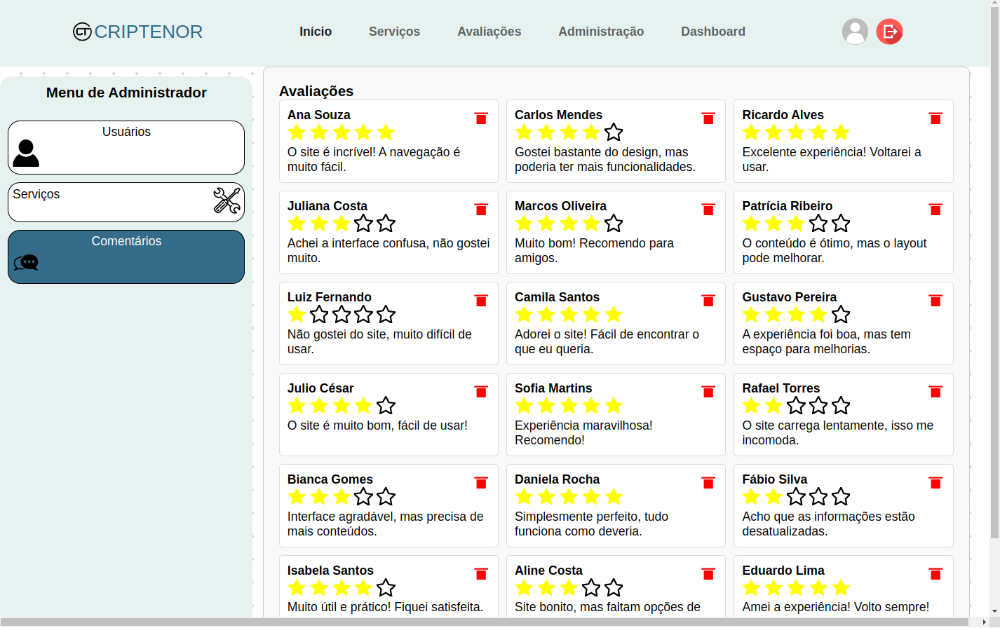

---

---

## Sumário

- [Entrar](#entrar)
- [Sair](#sair)
- [Entrar no Painel de Controle](#entrar-no-painel-de-controle)
- [Editar Nome do Usuário](#editar-nome-do-usuário)
- [Editar E-mail do Usuário](#editar-e-mail-do-usuário)
- [Editar Instagram do Usuário](#editar-instagram-do-usuário)
- [Excluir Registro de Usuário](#excluir-registro-de-usuário)
- [Editar Nome do Serviço](#editar-nome-do-serviço)
- [Editar Descrição do Serviço](#editar-descrição-do-serviço)
- [Editar Valor do Serviço](#editar-valor-do-serviço)
- [Excluir Registro do Serviço](#excluir-registro-do-serviço)
- [Excluir Avaliações](#excluir-avaliações)

---

## Entrar

1. Acesse a página de **Entrar**.  
2. Preencha os campos:  
   - **E-mail**  
   - **Senha**  
3. Clique no botão **Entrar**.  
4. O sistema redirecionará o usuário para o **Dashboard**.  

---

## Sair

1. Clique na sua **foto de perfil**, localizada no canto superior direito da tela.  
2. No menu que aparecer, clique na opção **Sair** para sair da conta neste dispositivo.

---

## Entrar no Painel de Controle

1. [Entre na sua conta de administrador](#entrar).  
     
2. Na barra de navegação principal na parte superior, clique no link **Administração**.  
   

---

## Editar Nome do Usuário

1. [Entre no painel de controle](#entrar-no-painel-de-controle).  
2. Identifique o usuário que deverá ser alterado.  
     
3. Clique no botão com o ícone de um **lápis** ao lado do nome.  
4. No campo **Nome**, altere o nome do usuário e clique em **Salvar**.

---

## Editar E-mail do Usuário

1. [Entre no painel de controle](#entrar-no-painel-de-controle).  
2. Identifique o usuário que deverá ser alterado.  
3. Clique no botão com o ícone de um **lápis** ao lado do nome.  
     
4. No campo **E-mail**, altere o endereço e clique em **Salvar**.

---

## Editar Instagram do Usuário

1. [Entre no painel de controle](#entrar-no-painel-de-controle).  
2. Identifique o usuário que deverá ser alterado.  
     
3. Clique no botão com o ícone de um **lápis** ao lado do nome.  
     
4. No campo **Instagram**, altere o link e clique em **Salvar**.

---

## Excluir Registro de Usuário

1. [Entre no painel de controle](#entrar-no-painel-de-controle).  
2. Identifique o usuário que deverá ser excluído.  
     
3. Clique no botão com o ícone de uma **lixeira**.  
     
4. Confirme a exclusão clicando em **Confirmar**, ou clique em **Cancelar**.

---

## Editar Nome do Serviço

1. [Entre no painel de controle](#entrar-no-painel-de-controle).  
2. No menu lateral esquerdo, selecione **Serviços**.  
3. Identifique o serviço desejado.  
     
4. Clique no botão com o ícone de um **lápis**.  
     
5. Altere o campo **Nome** e clique em **Salvar Alterações**.

---

## Editar Descrição do Serviço

1. [Entre no painel de controle](#entrar-no-painel-de-controle).  
2. No menu lateral esquerdo, selecione **Serviços**.  
     
3. Identifique o serviço desejado.  
4. Clique no botão com o ícone de um **lápis**.  
     
5. Altere o campo **Descrição** e clique em **Salvar Alterações**.

---

## Editar Valor do Serviço

1. [Entre no painel de controle](#entrar-no-painel-de-controle).  
2. No menu lateral esquerdo, selecione **Serviços**.  
     
3. Identifique o serviço desejado.  
4. Clique no botão com o ícone de um **lápis**.  
     
5. No campo **Valor**, atualize o preço e clique em **Salvar Alterações**.

---

## Excluir Registro do Serviço

1. [Entre no painel de controle](#entrar-no-painel-de-controle).  
2. No menu lateral esquerdo, selecione **Serviços**.  
     
3. Identifique o serviço que deverá ser excluído.  
4. Clique no botão com o ícone de uma **lixeira**.  
     
5. Confirme a exclusão clicando em **Confirmar**, ou clique em **Cancelar**.

---

## Excluir Avaliações

1. [Entre no painel de controle](#entrar-no-painel-de-controle).  
2. No menu lateral esquerdo, selecione **Comentários**.  
3. Identifique a avaliação que deverá ser excluída.  
4. Clique no ícone da **lixeira** ao lado da avaliação.  
     
5. Confirme a exclusão clicando em **Confirmar**, ou clique em **Cancelar**.

---
