.png)

## Sumário

- [Entrar](#entrar)
- [Sair](#sair)
- [Entrar no Painel de Controle](#entrar-no-painel-de-controle)
- [Editar Nome do Usuário](#editar-nome-do-usuario)
- [Editar E-mail do Usuário](#editar-e-mail-do-usuario)
- [Editar Instagram do Usuário](#editar-instagram-do-usuario)
- [Excluir Registro de Usuário](#excluir-registro-do-usuario)
- [Editar Nome do Serviço](#editar-nome-do-servico)
- [Editar Descrição do Serviço](#editar-descricao-do-servico)
- [Editar Valor do Serviço](#editar-valor-do-servico)
- [Excluir Registro de Serviço](#excluir-registro-do-servico)
- [Excluir Avaliações](#excluir-avaliacoes)

---

## Entrar

<!-- Adicione o conteúdo aqui -->
[Acesse o caso de uso correspondente](casos_de_uso.md#entrar)
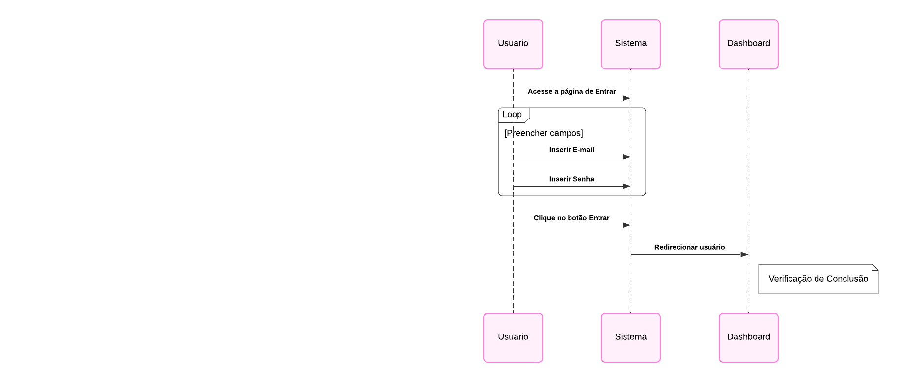

---

## Sair

<!-- Adicione o conteúdo aqui -->
[Acesse o caso de uso correspondente](casos_de_uso_adm.md#editar-nome-do-usuario)

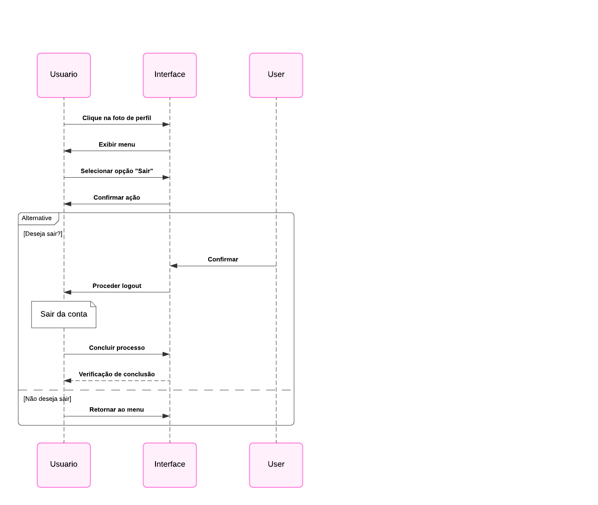

---

## Entrar no Painel de Controle
[Acesse o caso de uso correspondente](casos_de_uso.md#entrar-no-painel-de-controle)
<!-- Adicione o conteúdo aqui -->
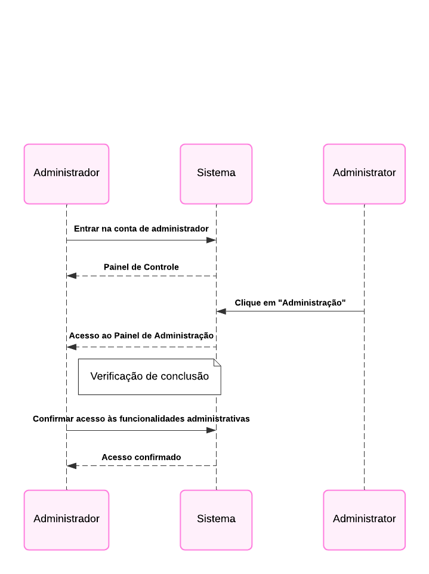

---

## Editar Nome do Usuário

<!-- Adicione o conteúdo aqui -->
[Acesse o caso de uso correspondente](casos_de_uso.md#editar-nome-do-usuario)
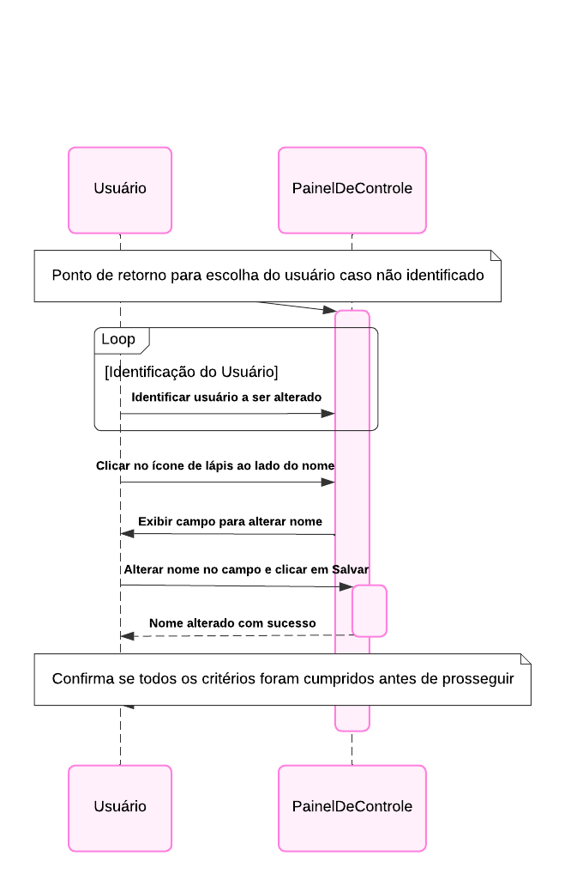

---

## Editar E-mail do Usuário

<!-- Adicione o conteúdo aqui -->
[Acesse o caso de uso correspondente](casos_de_uso.md#editar-e-mail-do-usuario)

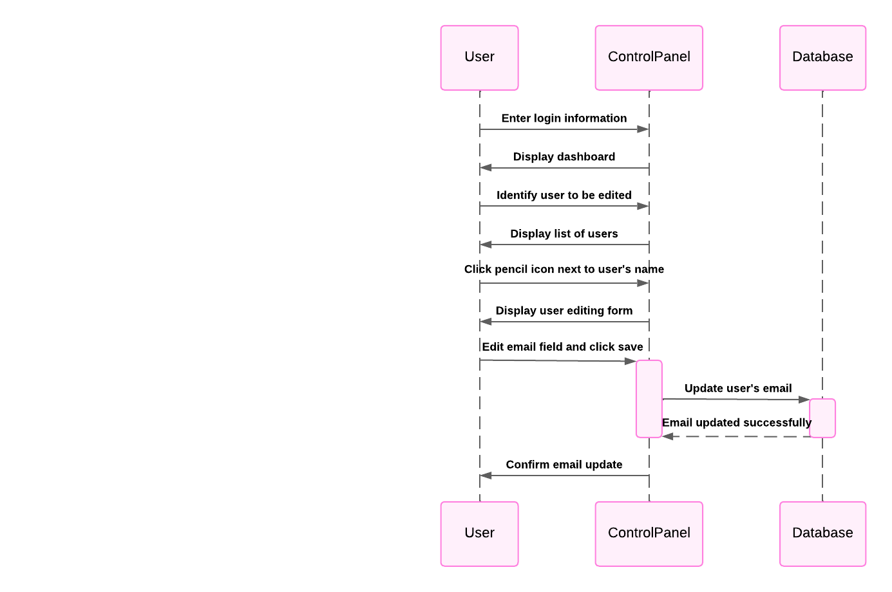

---

## Editar Instagram do Usuário

<!-- Adicione o conteúdo aqui -->

[Acesse o caso de uso correspondente](casos_de_uso.md#editar-instagram-do-usuario)
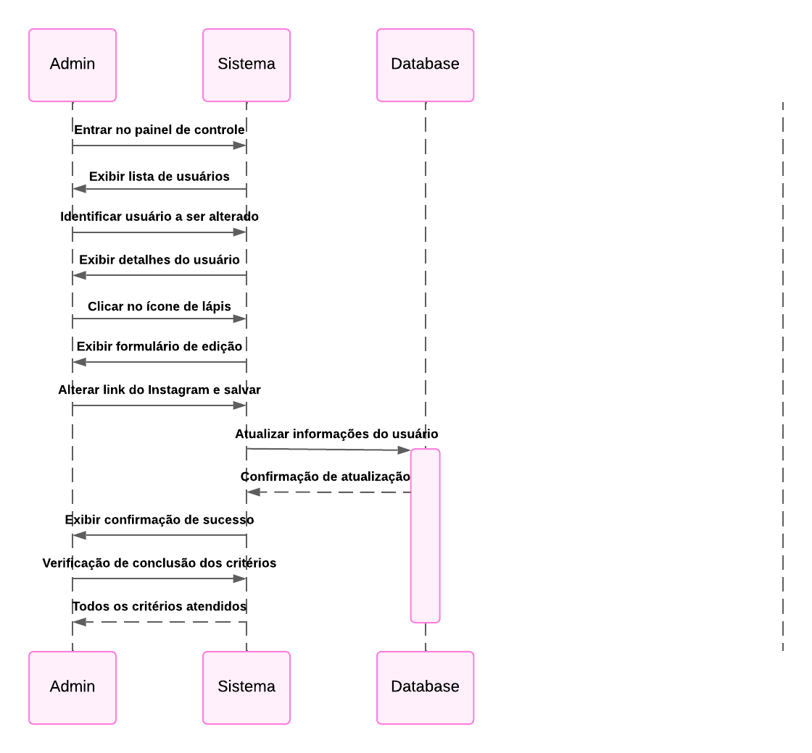

---

## Excluir Registro do Usuário

<!-- Adicione o conteúdo aqui -->
[Acesse o caso de uso correspondente](casos_de_uso.md#excluir-registro-de-usuario)
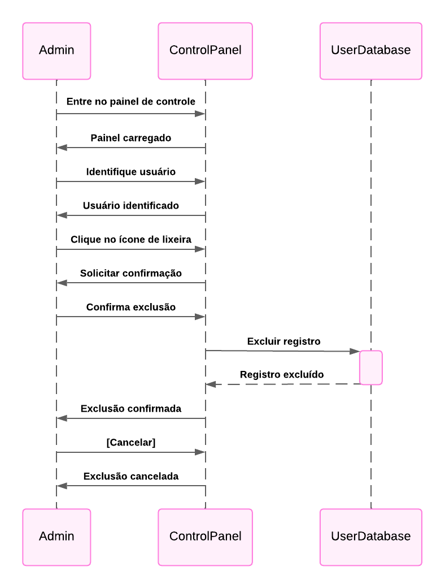

---

## Editar Nome do Serviço

<!-- Adicione o conteúdo aqui -->
[Acesse o caso de uso correspondente](casos_de_uso.md#editar-nome-do-servico)
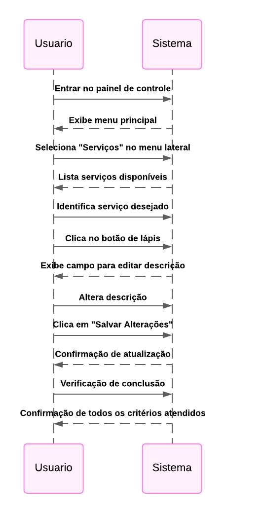

---

## Editar Descrição do Serviço

[Acesse o caso de uso correspondente](casos_de_uso.md#editar-descricao-do-servico)

<!-- Adicione o conteúdo aqui -->
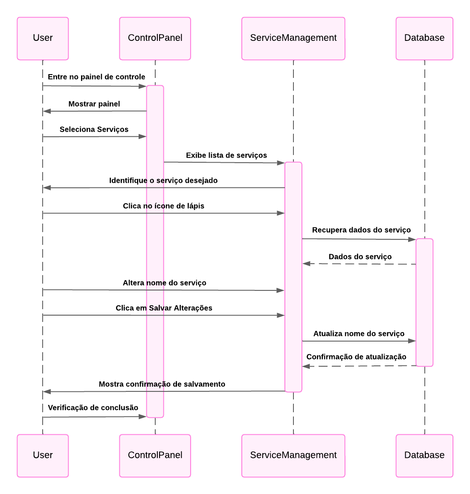

---

## Editar Valor do Serviço

<!-- Adicione o conteúdo aqui -->
[Acesse o caso de uso correspondente](casos_de_uso.md#editar-valor-do-servico)

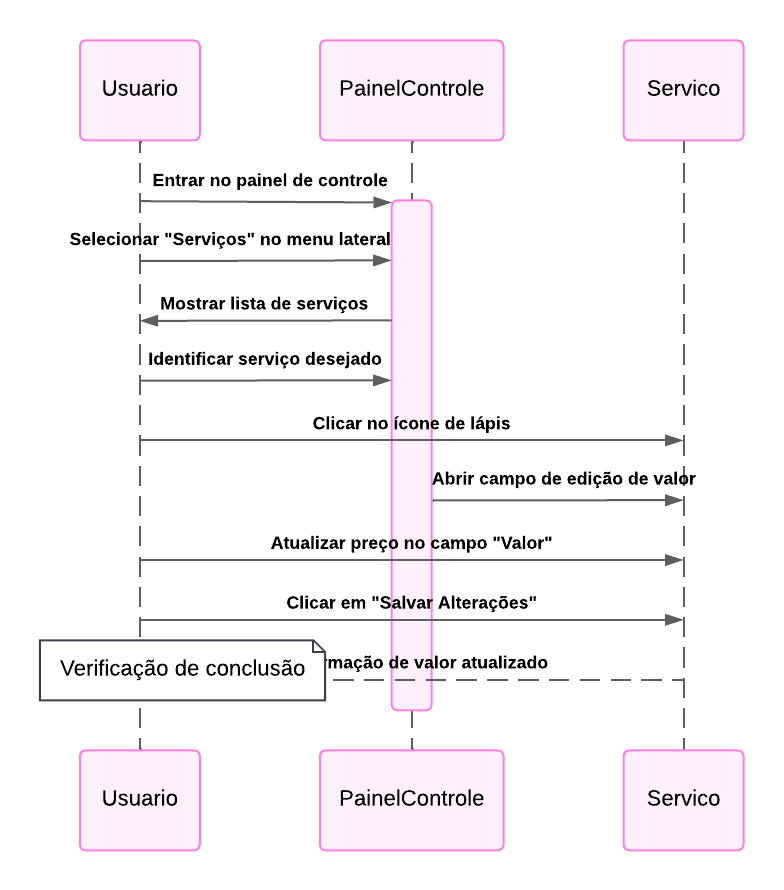
---

## Excluir Registro de Serviço

<!-- Adicione o conteúdo aqui -->
[Acesse o caso de uso correspondente](casos_de_uso.md#excluir-registro-de-servico)

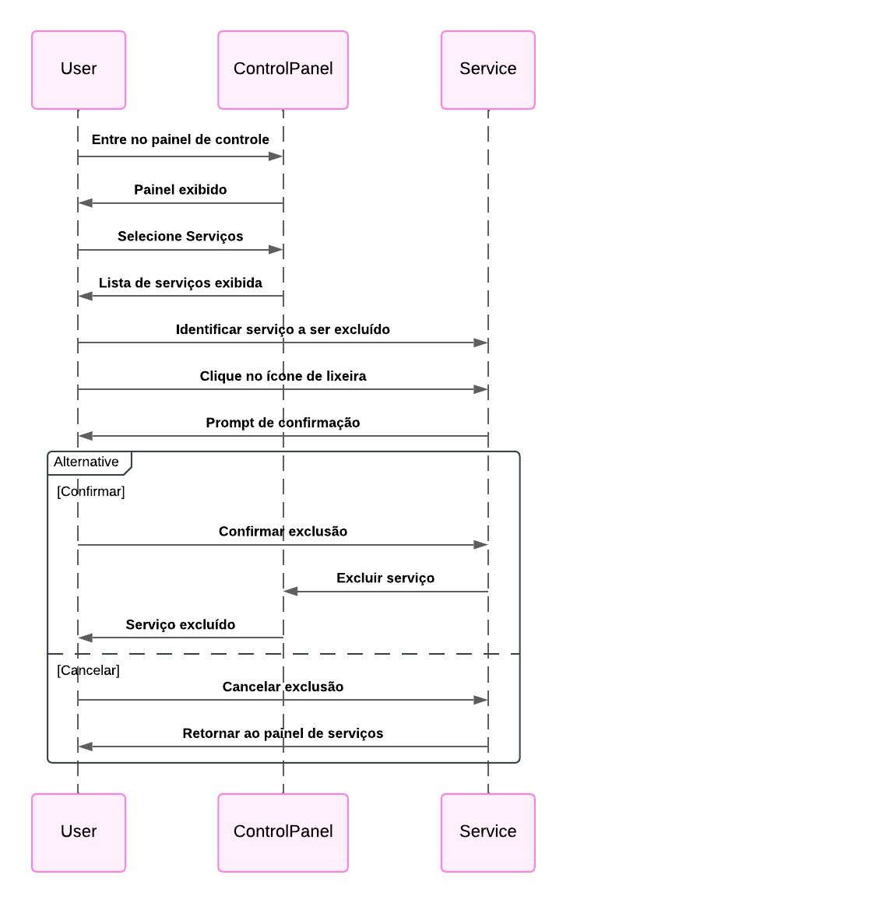

---

## Excluir Avaliações

<!-- Adicione o conteúdo aqui -->

[Acesse o caso de uso correspondente](casos_de_uso.md#excluir-avaliacoes)

---
