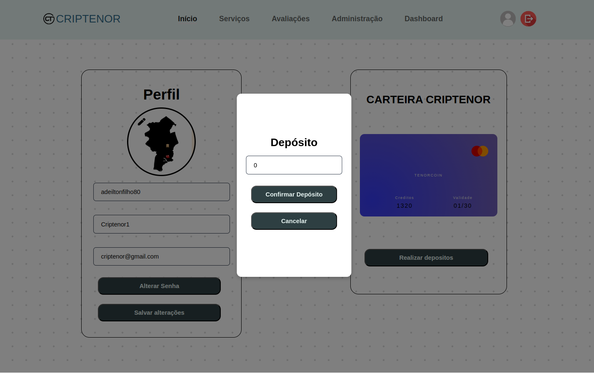

# Casos de Uso - Criptenor Dashboard

---

## Sumário

- [Cadastro](#cadastro)
- [Entrar](#entrar)
- [Visualizar Perfil](#visualizar-perfil)
- [Realizar Depósito no Perfil](#realizar-depósito-no-perfil)
- [Editar Nome do Perfil](#editar-nome-do-perfil)
- [Editar Arroba do Instagram do Perfil](#editar-arroba-do-instagram-do-perfil)
- [Editar E-mail do Perfil](#editar-e-mail-do-perfil)
- [Editar Senha do Perfil](#editar-senha-do-perfil)
- [Realizar Avaliação](#realizar-avaliação)
- [Visualizar as Avaliações Realizadas](#visualizar-as-avaliações-realizadas)
- [Entrar nas Redes Sociais da Criptenor](#entrar-nas-redes-sociais-da-criptenor)
- [Comprar Serviço](#comprar-serviço)
- [Visualizar Créditos Totais](#visualizar-créditos-totais)

---

## Cadastro

1. Acesse a página de **Cadastro**.  
2. Preencha os seguintes campos obrigatórios:  
   - **E-mail**  
   - **Senha**  
   - **Nome**  
   - **Arroba do Instagram**  

3. Clique no botão **Submit** para enviar o formulário.  
4. O sistema redirecionará você automaticamente para a página de **Login**.  

5. Insira o código que foi enviado para o email de cadastro
6. Clique em **Enviar**

---

## Entrar

1. Acesse a página de **Entrar**.  
2. Preencha os campos:  
   - **E-mail**  
   - **Senha**  
3. Clique no botão **Entrar**.  

4. O sistema redirecionará o usuário para o **Dashboard**.  

---

## Visualizar Perfil

1. [Entre na sua conta](#entrar).  
2. Clique na sua **foto de perfil**, localizada no canto superior direito da tela.  
3. No menu que será exibido, clique na opção **Perfil** para visualizar suas informações.  

---

## Realizar Depósito no Perfil

1. [Entre na sua conta](#entrar).  
2. Clique na sua **foto de perfil**, localizada no canto superior direito da tela.  
3. No menu que será exibido, clique na opção **Perfil** para visualizar suas informações.
  
4. Localize sua carteira no lado direito da tela.  
5. Clique no botão **Realizar Depósito**.  

6. Selecione o valor do depósito.  
7. Clique em **Confirmar Depósito**.  

---

## Editar Nome do Perfil

1. [Entre na sua conta](#entrar).  
2. Clique na sua **foto de perfil**, localizada no canto superior direito da tela.  
3. No menu que será exibido, clique na opção **Perfil** para visualizar suas informações.  
4. No canto esquerdo, localize a seção do seu perfil.  
5. Encontre o campo **Nome**, definido durante o [Cadastro](#cadastro). 
   
6. Edite o campo **Nome** conforme sua necessidade.  

---

## Editar Arroba do Instagram do Perfil

1. [Entre na sua conta](#entrar).  
2. Clique na sua **foto de perfil**, localizada no canto superior direito da tela.  
3. No menu que será exibido, clique na opção **Perfil** para visualizar suas informações.  
4. No canto esquerdo, localize a seção do seu perfil.  
5. Encontre o campo **Arroba Instagram**, definido durante o [Cadastro](#cadastro).  
6. Edite o campo **Arroba Instagram** conforme sua necessidade.  

---

## Editar E-mail do Perfil

1. [Entre na sua conta](#entrar).  
2. Clique na sua **foto de perfil**, localizada no canto superior direito da tela.  
3. No menu que será exibido, clique na opção **Perfil** para visualizar suas informações.  
4. No canto esquerdo, localize a seção do seu perfil.  
5. Encontre o campo **E-mail**, definido durante o [Cadastro](#cadastro).  
6. Edite o campo **E-mail** conforme sua necessidade.  

---

## Editar Senha do Perfil

1. [Entre na sua conta](#entrar).  
2. Clique na sua **foto de perfil**, localizada no canto superior direito da tela.  
3. No menu que será exibido, clique na opção **Perfil** para visualizar suas informações.  
4. No canto esquerdo, localize a seção do seu perfil.  
5. Clique no botão **Alterar Senha**, definido durante o [Cadastro](#cadastro).  
6. Digite a nova senha e confirme a nova senha.  
7. Clique em **Confirmar** caso realmente queira alterar. Caso não queira, clique em **Cancelar**.  

---

## Realizar Avaliação

1. Entre na página principal.  

2. Na barra de navegação superior, clique em **Avaliações**.  
3. Insira seu nome e sua descrição.  
4. Realize uma avaliação de 1 a 5 para o site.  

5. Clique no botão **Enviar**.  

---

## Visualizar as Avaliações Realizadas

1. Entre na página principal.  
2. Na barra de navegação superior, clique em **Avaliações**.  

3. No canto direito, navegue com os botões **Voltar** e **Avançar** para ler as avaliações.  

---

## Entrar nas Redes Sociais da Criptenor

1. Entre na página principal/raiz.  
2. Role até o final.  

3. Localize no rodapé as redes sociais da Criptenor.  

---

## Comprar Serviço

1. [Entre na sua conta](#entrar).  
2. Entre na página principal.  

3. Na barra de navegação superior, clique em **Dashboard**.  
  
4. Selecione o serviço que você quer.  

5. Visualize o serviço.  

---

## Visualizar Créditos Totais

1. [Entre na sua conta](#entrar).  
2. Clique na sua **foto de perfil**, localizada no canto superior direito da tela.  

3. No menu que será exibido, clique em **Créditos**, sendo o terceiro item do menu suspenso.  

---

## Sair

1. Clique na sua **foto de perfil**, localizada no canto superior direito da tela.  

2. No menu que será exibido, clique na opção **Sair** para sair de sua conta nesse dispositivo.

--- 

