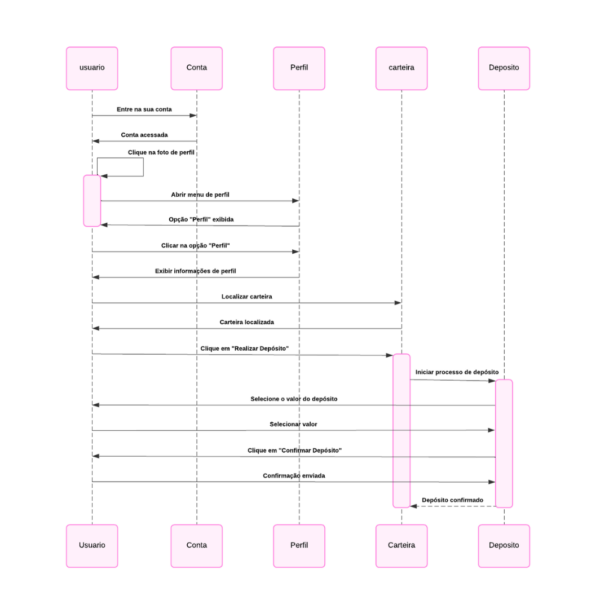
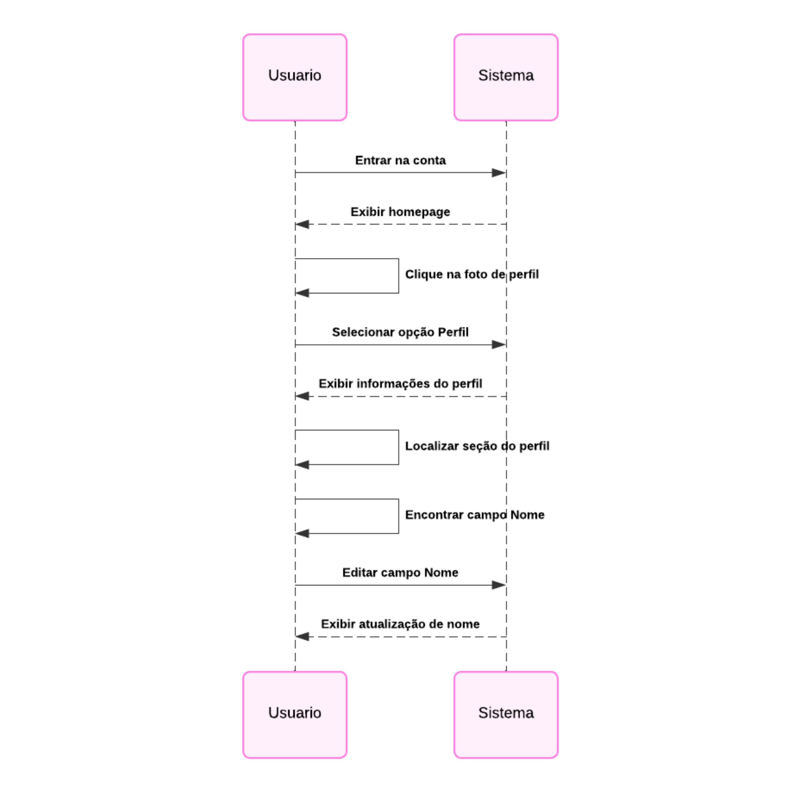
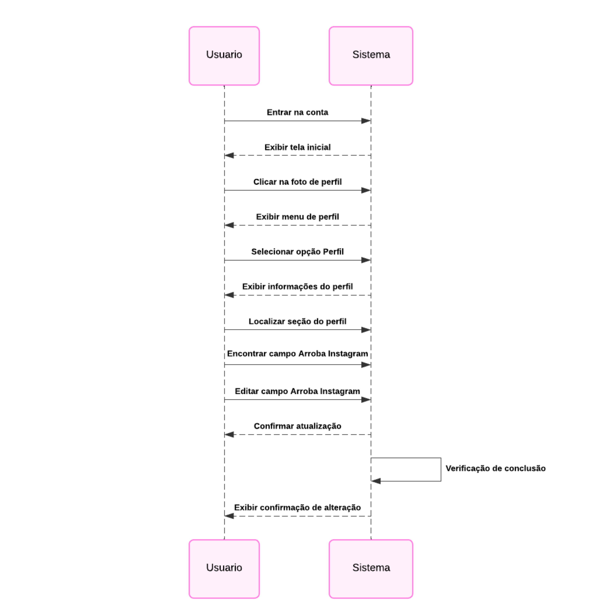
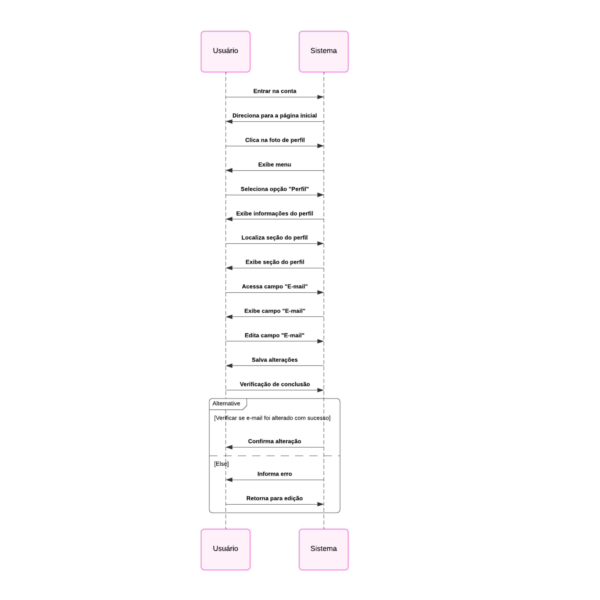
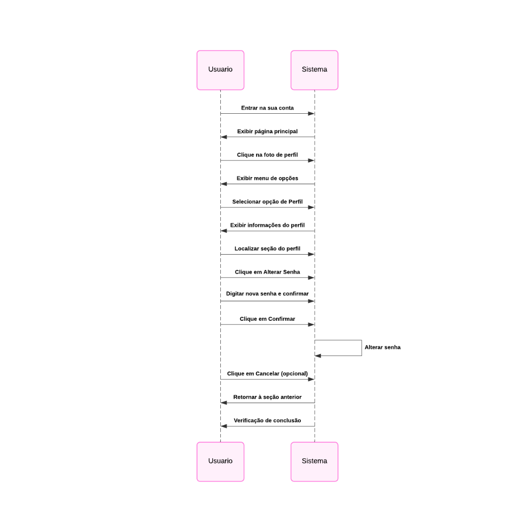
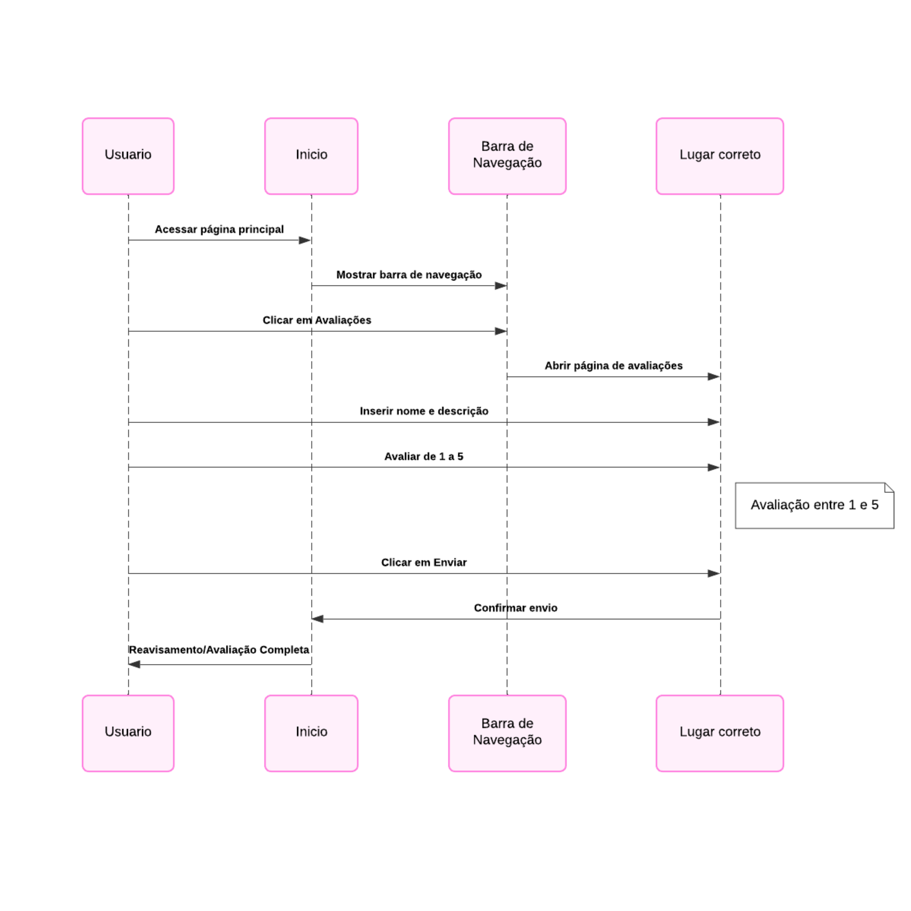

# Casos de Uso - Criptenor Dashboard
.png)

---

## Sumário

- [Cadastro](#cadastro)
- [Entrar](#entrar)
- [Visualizar Perfil](#visualizar-perfil)
- [Realizar Depósito no Perfil](#realizar-depósito-no-perfil)
- [Editar Nome do Perfil](#editar-nome-do-perfil)
- [Editar Arroba do Instagram do Perfil](#editar-arroba-do-instagram-do-perfil)
- [Editar E-mail do Perfil](#editar-e-mail-do-perfil)
- [Editar Senha do Perfil](#editar-senha-do-perfil)
- [Realizar Avaliação](#realizar-avaliação)
- [Visualizar as Avaliações Realizadas](#visualizar-as-avaliações-realizadas)
- [Entrar nas Redes Sociais da Criptenor](#entrar-nas-redes-sociais-da-criptenor)
- [Comprar Serviço](#comprar-serviço)
- [Visualizar Créditos Totais](#visualizar-créditos-totais)
- [Sair](#sair)

---

## Cadastro

Acesse a página de Cadastro e preencha os campos obrigatórios como **E-mail**, **Senha**, **Nome** e **Arroba do Instagram**. Confirme o cadastro com o código enviado por e-mail.

.png)

---

## Entrar

Na página de Login, insira o **E-mail** e **Senha** para acessar o Dashboard.
.png)

---

## Visualizar Perfil

Acesse o menu da sua foto de perfil no canto superior direito e clique em **Perfil**.
.png)

---

## Realizar Depósito no Perfil

Na seção **Carteira**, clique em **Realizar Depósito**, escolha o valor e confirme.

---

## Editar Nome do Perfil

No menu **Perfil**, localize o campo **Nome** e edite conforme necessário.

---

## Editar Arroba do Instagram do Perfil

No menu **Perfil**, localize o campo **Arroba Instagram** e edite conforme necessário.

---

## Editar E-mail do Perfil

No menu **Perfil**, localize o campo **E-mail** e edite conforme necessário.

---

## Editar Senha do Perfil

No menu **Perfil**, clique em **Alterar Senha**, insira e confirme a nova senha.

---

## Realizar Avaliação

Na barra de navegação, acesse **Avaliações**, insira seu nome, descrição e nota (1 a 5), e clique em **Enviar**.

---

## Visualizar as Avaliações Realizadas

Na barra de navegação em **Avaliações**, utilize os botões de navegação para visualizar avaliações.
.png)

---

## Entrar nas Redes Sociais da Criptenor

No rodapé da página principal, clique nos ícones das redes sociais.
.png)

---

## Comprar Serviço

No **Dashboard**, selecione o serviço desejado para visualizar detalhes e concluir a compra.
.png)

---

## Visualizar Créditos Totais

No menu suspenso do perfil, clique em **Créditos** para visualizar o total disponível.
.png)

---

## Sair

Clique na sua **foto de perfil**, no menu suspenso selecione **Sair** para encerrar a sessão.
.png)

---

